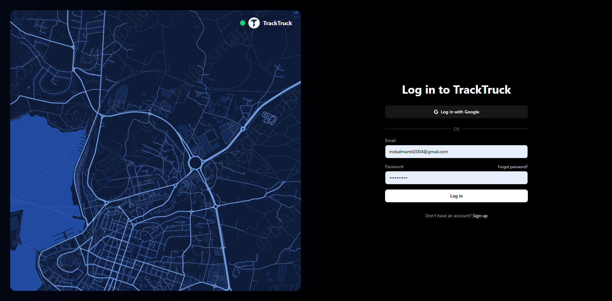
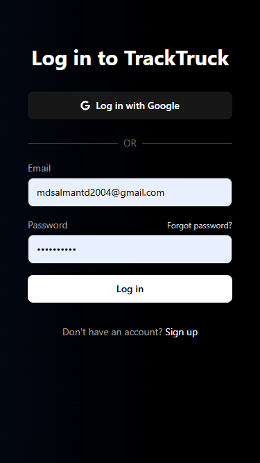
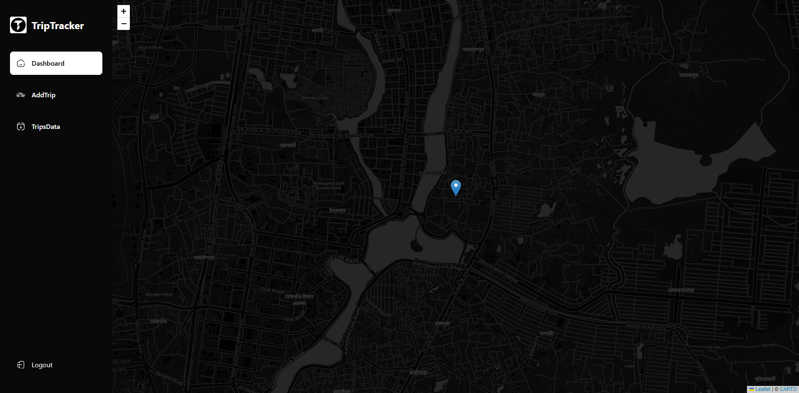
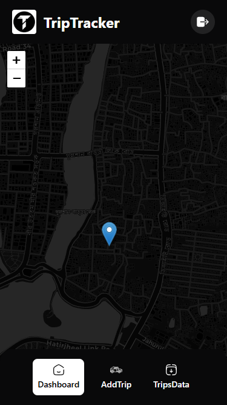
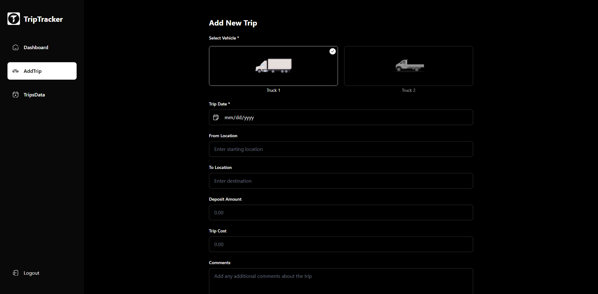
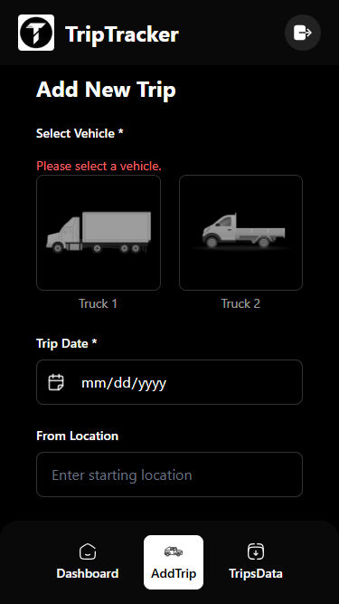

# 🚛 TrackTruck Frontend – Demo Version

This is the **demo version** of the **TrackTruck** web application – a full-stack system designed to help truck owners and drivers manage trips, costs, and payments efficiently. This version includes a secure login system, dashboard UI, trip management interface, and mobile responsiveness.

---

## ✨ Features

- ✅ Secure login system with JWT (cookie-based authentication)
- ✅ Responsive user dashboard for managing trips
- ✅ Add trip form with real-time validation
- ✅ Global auth state using React Context
- ✅ Error handling with user-friendly feedback
- ✅ Mobile & desktop friendly UI
- ✅ Protected routes and redirect handling
- ✅ Easy integration-ready backend API

---

## 🖼️ Screenshots

### 🔐 Login Page (Desktop & Mobile)




---

### 📊 Dashboard View (Desktop & Mobile)




---

### ✍️ Add Trip View (Desktop & Mobile)




---

## ⚙️ Getting Started

### 1. Start the Backend

```bash
cd Backend
npm install
npm start
```

> Backend runs at: `http://localhost:3000`

---

### 2. Start the Frontend

```bash
cd Frontend
npm install
npm run dev
```

> Frontend runs at: `http://localhost:5173`

---

## 🔐 Authentication Flow

1. User enters email & password on `/login`
2. Credentials are sent to `POST /api/users/login`
3. Backend validates and returns an HTTP-only JWT cookie
4. Frontend fetches current user via `GET /api/users/me`
5. AuthContext stores user state globally
6. User is redirected to `/dashboard`

---

## 🧭 Core Pages in Demo

| Route             | Purpose                        |
|------------------|--------------------------------|
| `/login`         | User login                     |
| `/dashboard`     | Overview of trips & status     |
| `/add-trip`      | Add new trip records           |
| (Protected)      | Requires login (JWT auth)      |

---

## 📦 API Endpoints Used

| Method | Endpoint               | Description              |
|--------|------------------------|--------------------------|
| POST   | `/api/users/login`     | Authenticate user        |
| POST   | `/api/users/register`  | Create new user          |
| GET    | `/api/users/me`        | Get logged-in user info  |
| POST   | `/api/users/logout`    | Clear session JWT        |

---

## 🧪 How to Test Locally

1. Start both backend and frontend servers
2. Open `http://localhost:5173/login` in your browser
3. Use test credentials or register a new user
4. Add a trip from the dashboard
5. View trip updates in real-time

---

## ⚠️ Error Handling

| Issue                     | Message Displayed                  |
|--------------------------|-------------------------------------|
| Empty inputs              | "Email and password are required"  |
| Invalid email format      | "Please enter a valid email"       |
| Wrong credentials         | "Email or Password is incorrect"   |
| Network/server issues     | "An unexpected error occurred"     |

---

## 🧰 Tech Stack

- **Frontend**: React + Vite + Tailwind CSS + Axios + React Router
- **Backend**: Node.js + Express + MongoDB + JWT
- **State Management**: React Context API
- **Auth System**: HTTP-only cookie-based JWT

---

## ✅ Status

🚀 This demo version includes:
- Secure auth system
- Basic dashboard & trip UI
- Fully responsive layout  
🔒 Ideal foundation for:
- Admin panel  
- Trip reporting & analytics  
- Driver Live Location tracking  
- SMS/notification integrations

---

## 📄 License

This project is licensed under the MIT License.

---

> Built by **Md Salman TD** — for Truck/Car owners and drivers.
